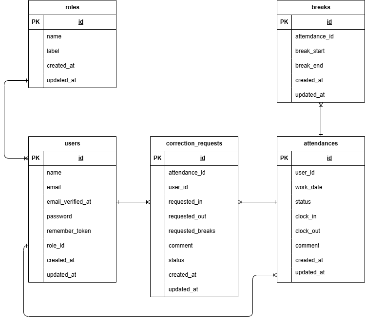

# coachtech勤怠管理アプリ

## 概要

ある企業が開発した独自の勤怠管理アプリです。

## 環境構築

**Dockerビルド**

1. git clone git@github.com:NoriyoshiUmeda/kintai-manager.gitを貼り付け
2. DockerDesktopアプリを立ち上げる
3. `docker-compose up -d --build`

> _MacのM1・M2チップのPCの場合、`no matching manifest for linux/arm64/v8 in the manifest list entries`のメッセージが表示されビルドができないことがあります。
> エラーが発生する場合は、docker-compose.ymlファイルの「mysql」内に「platform」の項目を追加で記載してください_

```bash
mysql:
    platform: linux/x86_64(この文追加)
    image: mysql:8.0.26
    environment:
```

**Laravel環境構築**

1. `docker-compose exec php bash`
2. `composer install`
3. 「.env.example」ファイルを 「.env」ファイルに命名を変更。または、新しく.envファイルを作成
4. .envに以下の環境変数を追加

```text
DB_CONNECTION=mysql
DB_HOST=mysql
DB_PORT=3306
DB_DATABASE=laravel_db
DB_USERNAME=laravel_user
DB_PASSWORD=laravel_pass
```

5. アプリケーションキーの作成

```bash
php artisan key:generate
```

6. マイグレーションの実行

```bash
php artisan migrate
```

7. シーディングの実行

```bash
php artisan db:seed
```


## メール認証
mailtrapというツールを使用しています。
以下のリンクから会員登録をしてください。　
https://mailtrap.io/

メールボックスのIntegrationsから 「laravel 7.x and 8.x」を選択し、　
.envファイルのMAIL_MAILERからMAIL_ENCRYPTIONまでの項目をコピー＆ペーストしてください。　
MAIL_FROM_ADDRESSは任意のメールアドレスを入力してください。　


## ログイン情報（テスト用）

### 管理者ユーザー

- email: user1@example.com
- password: password

### 一般ユーザー

- email: user2@example.com
- password: password

## 使用技術(実行環境)

- PHP8.1
- Laravel8.83.8
- MySQL8.0.26

### PHPバージョンについて

本プロジェクトは PHP 8.1 環境で動作確認されています。  
Dockerfile では `php:8.1-fpm` を使用しており、PHP 8.2 以上では依存パッケージの互換性により `composer install` 時にエラーが発生する可能性があります。  
そのため、環境構築時には PHP 8.1 の使用を推奨します。

## ER図



## URL

- 開発環境： http://localhost/
- phpMyAdmin: http://localhost:8080/
